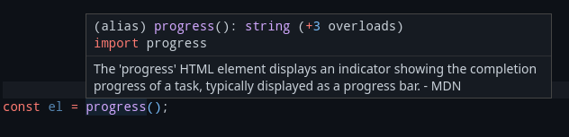

# tsTags: typescript HTML generator

[](https://www.npmjs.com/package/tstags)

Simply and quickly generate HTML. No need to write HTML directly.

## What it does?

Turns this:

```typescript
section([
  h1(article.title),
  h2(article.subtitle),
  div({ class: 'my-class' }, p(article.text)),
]);
```

Into this:

```html
<section>
  <h1>Title</h1>
  <h2>Subtitle</h2>
  <div class="my-class">
    <p>Lorem ipsum dolor sit amet consectetur adipisicing elit.</p>
  </div>
</section>
```

### Custom tags

You can also use custom tags:

```typescript
tag('outer-tag', tag('inner-tag'));
```

And generate:

```html
<outer-tag><inner-tag></inner-tag></outer-tag>
```

### CSS-like class and id specifiers

With `tag` you can also specify class and id in the selector.

```typescript
tag('div.wrap', tag('div#id123'));
```

```HTML
<div class="wrap"><div id="id123"></div></div>
```

`tag` might also be better, that you don't need to import a separate function for each tag type.

### Syntax

#### Empty elements:

```typescript
title();
// or
tag('title');
```

Both become the same:

```HTML
<title></title>
```

#### Attributes:

```typescript
a({ href: 'url' });
// or
tag('a', { href: 'url' });
```

```HTML
<a href="url"></a>
```

#### Inner data:

String:

```typescript
div('Content');
// or
tag('div', 'Content');
```

```HTML
<div>Content</div>
```

Element:

```typescript
div(button());
// or
tag('div', tag('button'));
```

```HTML
<div><button></button></div>
```

Or multiple inner elements:

```typescript
ul([
  li('Apples'),
  li('Bees'),
  li('Cider'),
  li('Deer'),
  li('Egg'),
  li('Fruit'),
  li('Gorilla'),
]);
// or
tag('ul', [
  tag('li', 'Apples'),
  tag('li', 'Bees'),
  tag('li', 'Cider'),
  tag('li', 'Deer'),
  tag('li', 'Egg'),
  tag('li', 'Fruit'),
  tag('li', 'Gorilla'),
]);
```

```HTML
<ul>
  <li>Apples</li>
  <li>Bees</li>
  <li>Cider</li>
  <li>Deer</li>
  <li>Egg</li>
  <li>Fruit</li>
  <li>Gorilla</li>
</ul>
```

Of course you can combine the syntax in any reasonable way. The advantage of tag is that you need to import only one function, which may or may not matter, depending on your use-case.

Generated HTML is not formatted.

If you want to write the result to a file, simply use something like:

```javascript
fs = require('fs');

fs.writeFileSync('index.html', myGeneratedHtml);
```

### Tag description

MDN description in tooltip.


